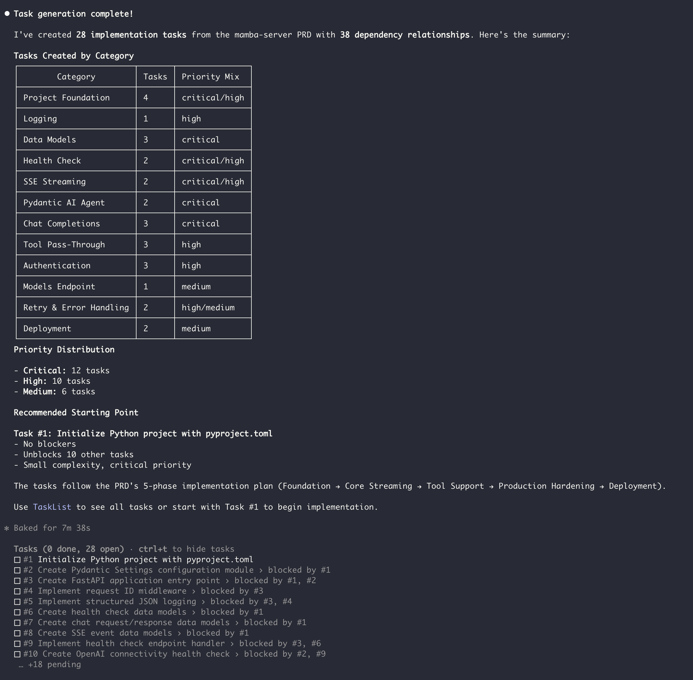

# Claude Alchemy

**Supercharge your Claude Code workflow with powerful plugins and a visual task manager.**

Claude Alchemy is a collection of tools and apps designed to help developers get the most out of [Claude Code](https://docs.anthropic.com/en/docs/claude-code).


**See more screenshots [screenshots](#screenshots) below**

## Task Manager

**See your Claude Code Tasks in real-time.**

The Task Manager is a real-time Kanban board that visualizes Claude's native task system (`~/.claude/tasks/`). Watch tasks flow from Pending → In Progress → Completed as Claude works through your project.

**Key Features:**
- **Real-time updates** — Tasks update instantly via Server-Sent Events as Claude works
- **Dependency tracking** — See which tasks block others and track completion flow
- **Statistics dashboard** — Monitor progress with completion percentages and blocked task counts
- **Search & filter** — Quickly find tasks across large task lists
- **Dark/light themes** — Easy on the eyes during those long coding sessions

```bash
cd claude-apps/task-manager
pnpm install && pnpm dev  # Starts on http://localhost:3030
```

> **New to Claude Code Tasks?** Check out the [Tasks Cheatsheet](./internal/docs/claude-tasks-cheatsheet.md) for tips on setting up `CLAUDE_CODE_TASK_LIST_ID`, task dependencies, and best practices.


## Plugins

| Package | Description |
|---------|-------------|
| **sdd-tools** | Spec generation, analysis, and task creation |
| **dev-tools** | Feature development workflows, Git automation, and release management |

**Install:**

```bash
claude plugins add sequenzia/claude-alchemy
```

Or individually: `claude plugins add sequenzia/claude-alchemy/claude-tools/sdd-tools`

### sdd-tools (v0.1.0)

Generate specifications through interactive interviews with depth-aware templates and research capabilities.

| Command | Description |
|---------|-------------|
| `/sdd-tools:create-spec` | Start spec creation workflow |
| `/sdd-tools:analyze-spec <path>` | Analyze existing spec for quality issues |
| `/sdd-tools:create-tasks <path>` | Generate Claude Code native Tasks from spec |
| `/sdd-tools:execute-tasks [task-id]` | Execute pending tasks in dependency order |

**Features:**
- Three depth levels (high-level, detailed, full technical)
- Adaptive interviews with proactive recommendations
- On-demand research for technical docs and compliance
- Spec quality analysis with interactive resolution
- Native Claude Code Task generation with dependencies

### dev-tools (v0.3.0)

Developer tools for feature development, codebase analysis, Git workflows, and release automation.

| Command | Description |
|---------|-------------|
| `/dev-tools:analyze-codebase [path]` | Generate comprehensive codebase analysis report |
| `/dev-tools:feature-dev <description>` | Feature development workflow (7 phases) |
| `/dev-tools:git-commit` | Stage and commit with conventional message |
| `/dev-tools:git-push` | Push to remote with automatic rebase |
| `/dev-tools:release [version]` | Python package release workflow |
| `/dev-tools:bump-plugin-version` | Bump plugin version in this repository |

**Features:**
- 7-phase feature development workflow
- Codebase exploration with parallel agents
- Architecture design with trade-off analysis
- Code review with confidence scoring
- 9-step release verification pipeline

## Workflow Integration

The plugins and apps work together for a complete development workflow:

```
Spec Creation → Task Generation → Task Visualization → Implementation → Release
     ↓               ↓                  ↓                   ↓            ↓
 sdd-tools     sdd-tools:          task-manager        dev-tools:    dev-tools
              create-tasks              app            feature-dev    (release)
```

## Screenshots

### Task Manager Kanban View


### Tasks Generated from sdd-tools


### Single Task View with Dependencies, Test Cases and Acceptance Criteria


### Completed Tasks in Claude Code


## Development

### Prerequisites

- Node.js >= 18
- pnpm >= 8

### Setup

```bash
# Clone the repository
git clone https://github.com/sequenzia/claude-alchemy.git
cd claude-alchemy

# Install dependencies
pnpm install

# Start task-manager
pnpm dev:task-manager
```

### Workspace Commands

```bash
pnpm dev:task-manager     # Start task-manager dev server
pnpm build:task-manager   # Build task-manager for production
pnpm lint                 # Run linting across all workspaces
```

## License

MIT
