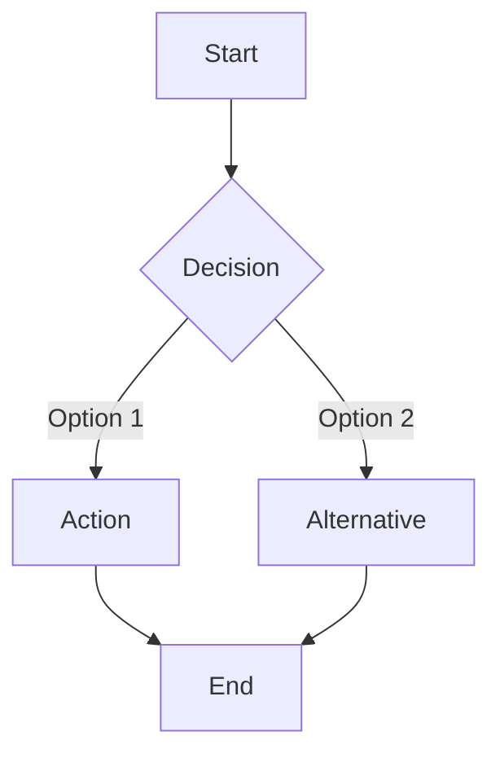

# Spec: {Product Name}

**Version**: 1.0
**Author**: {Author}
**Date**: {Date}
**Status**: Draft

---

## 1. Executive Summary

{Brief 2-3 sentence overview of what this product/feature does and why it matters.}

## 2. Problem Statement

### 2.1 The Problem
{What problem are we solving? Who experiences this problem?}

### 2.2 Current State
{How is this problem currently addressed (or not)?}

### 2.3 Impact Analysis
{What is the cost/impact of not solving this problem? Include quantitative data where available.}

### 2.4 Business Value
{Why should we invest in solving this now? Strategic alignment, revenue impact, user retention, etc.}

## 3. Goals & Success Metrics

### 3.1 Primary Goals
1. {Goal 1}
2. {Goal 2}
3. {Goal 3}

### 3.2 Success Metrics

| Metric | Current Baseline | Target | Measurement Method | Timeline |
|--------|------------------|--------|-------------------|----------|
| {Metric 1} | {baseline} | {goal} | {how measured} | {when} |
| {Metric 2} | {baseline} | {goal} | {how measured} | {when} |

### 3.3 Non-Goals
- {What we are explicitly NOT trying to achieve}

## 4. User Research

### 4.1 Target Users

#### Primary Persona: {Name}
- **Role/Description**: {who they are}
- **Goals**: {what they want to achieve}
- **Pain Points**: {current frustrations}
- **Context**: {when/where they use the product}
- **Technical Proficiency**: {level}

#### Secondary Persona: {Name}
- **Role/Description**: {who they are}
- **Goals**: {what they want to achieve}
- **Pain Points**: {current frustrations}

### 4.2 User Journey Map

```
[Current State] --> [Trigger] --> [Action 1] --> [Action 2] --> [Outcome]
     |                 |              |              |             |
     v                 v              v              v             v
  {context}       {what triggers}  {first step}  {next step}  {result}
```

### 4.3 User Workflows

#### Workflow 1: {Name}


## 5. Functional Requirements

### 5.1 Feature: {Feature Name}

**Priority**: P0 (Critical)
**Complexity**: High/Medium/Low

#### User Stories

**US-001**: As a {user type}, I want {capability} so that {benefit}.

**Acceptance Criteria**:
- [ ] {Specific, testable criterion 1}
- [ ] {Specific, testable criterion 2}
- [ ] {Specific, testable criterion 3}

**Technical Notes**:
- {Implementation consideration 1}
- {Implementation consideration 2}

**Edge Cases**:
| Scenario | Input | Expected Behavior |
|----------|-------|-------------------|
| {Case 1} | {input} | {behavior} |
| {Case 2} | {input} | {behavior} |

**Error Handling**:
| Error Condition | User Message | System Action |
|-----------------|--------------|---------------|
| {Condition 1} | {message} | {action} |

---

### 5.2 Feature: {Feature Name}

**Priority**: P1 (High)
**Complexity**: Medium

#### User Stories

**US-002**: As a {user type}, I want {capability} so that {benefit}.

**Acceptance Criteria**:
- [ ] {Specific, testable criterion 1}
- [ ] {Specific, testable criterion 2}

---

## 6. Non-Functional Requirements

### 6.1 Performance Requirements

| Metric | Requirement | Measurement Method |
|--------|-------------|-------------------|
| Response Time (P50) | < {X}ms | APM monitoring |
| Response Time (P99) | < {X}ms | APM monitoring |
| Throughput | {X} requests/sec | Load testing |
| Concurrent Users | {X} users | Load testing |

### 6.2 Security Requirements

#### Authentication
- {Authentication method and requirements}

#### Authorization
| Role | Permissions |
|------|------------|
| {Role 1} | {permissions} |
| {Role 2} | {permissions} |

#### Data Protection
- Encryption at rest: {requirements}
- Encryption in transit: {requirements}
- PII handling: {requirements}

### 6.3 Scalability Requirements
- Horizontal scaling: {requirements}
- Expected growth: {projections}
- Peak load handling: {requirements}

### 6.4 Reliability Requirements
- Uptime SLA: {percentage}
- Recovery Time Objective (RTO): {time}
- Recovery Point Objective (RPO): {time}

### 6.5 Accessibility Requirements
- WCAG compliance level: {level}
- Screen reader support: {requirements}
- Keyboard navigation: {requirements}

## 7. Technical Architecture

### 7.1 System Overview

```
┌─────────────────────────────────────────────────────────────┐
│                      Client Layer                            │
│  ┌─────────────┐  ┌─────────────┐  ┌─────────────┐         │
│  │   Web App   │  │ Mobile App  │  │    CLI      │         │
│  └─────────────┘  └─────────────┘  └─────────────┘         │
└─────────────────────────────────────────────────────────────┘
                           │
                           ▼
┌─────────────────────────────────────────────────────────────┐
│                      API Gateway                             │
│  - Authentication  - Rate Limiting  - Routing               │
└─────────────────────────────────────────────────────────────┘
                           │
                           ▼
┌─────────────────────────────────────────────────────────────┐
│                    Service Layer                             │
│  ┌─────────────┐  ┌─────────────┐  ┌─────────────┐         │
│  │  Service A  │  │  Service B  │  │  Service C  │         │
│  └─────────────┘  └─────────────┘  └─────────────┘         │
└─────────────────────────────────────────────────────────────┘
                           │
                           ▼
┌─────────────────────────────────────────────────────────────┐
│                     Data Layer                               │
│  ┌─────────────┐  ┌─────────────┐  ┌─────────────┐         │
│  │  Database   │  │    Cache    │  │   Storage   │         │
│  └─────────────┘  └─────────────┘  └─────────────┘         │
└─────────────────────────────────────────────────────────────┘
```

### 7.2 Tech Stack

| Layer | Technology | Justification |
|-------|------------|---------------|
| Frontend | {tech} | {reason} |
| Backend | {tech} | {reason} |
| Database | {tech} | {reason} |
| Cache | {tech} | {reason} |
| Queue | {tech} | {reason} |
| Infrastructure | {tech} | {reason} |

### 7.3 Data Models

#### Entity: {Entity Name}

```
┌────────────────────────────────┐
│         {Entity Name}          │
├────────────────────────────────┤
│ id: UUID (PK)                  │
│ field_1: string                │
│ field_2: integer               │
│ field_3: timestamp             │
│ created_at: timestamp          │
│ updated_at: timestamp          │
├────────────────────────────────┤
│ Indexes:                       │
│ - idx_field_1 (field_1)        │
│ - idx_composite (field_1, 2)   │
└────────────────────────────────┘
```

**Field Definitions**:
| Field | Type | Constraints | Description |
|-------|------|-------------|-------------|
| id | UUID | PK, NOT NULL | Unique identifier |
| field_1 | VARCHAR(255) | NOT NULL | {description} |
| field_2 | INTEGER | DEFAULT 0 | {description} |

#### Entity Relationships

```
┌──────────┐       ┌──────────┐       ┌──────────┐
│ Entity A │ 1───* │ Entity B │ *───1 │ Entity C │
└──────────┘       └──────────┘       └──────────┘
```

### 7.4 API Specifications

#### Endpoint: `POST /api/v1/{resource}`

**Purpose**: {What this endpoint does}

**Authentication**: Required (Bearer token)

**Rate Limit**: {X} requests/minute

**Request**:
```http
POST /api/v1/{resource}
Content-Type: application/json
Authorization: Bearer {token}

{
  "field_1": "string (required) - Description",
  "field_2": "integer (optional) - Description, default: 0",
  "field_3": {
    "nested_field": "string (required) - Description"
  }
}
```

**Response**:

`201 Created`
```json
{
  "id": "uuid",
  "field_1": "value",
  "field_2": 0,
  "created_at": "2024-01-01T00:00:00Z"
}
```

`400 Bad Request`
```json
{
  "error": {
    "code": "VALIDATION_ERROR",
    "message": "Field validation failed",
    "details": [
      {
        "field": "field_1",
        "message": "Required field missing"
      }
    ]
  }
}
```

`401 Unauthorized`
```json
{
  "error": {
    "code": "UNAUTHORIZED",
    "message": "Invalid or expired token"
  }
}
```

---

#### Endpoint: `GET /api/v1/{resource}/{id}`

**Purpose**: {What this endpoint does}

**Authentication**: Required (Bearer token)

**Request**:
```http
GET /api/v1/{resource}/{id}
Authorization: Bearer {token}
```

**Response**:

`200 OK`
```json
{
  "id": "uuid",
  "field_1": "value",
  "field_2": 0,
  "created_at": "2024-01-01T00:00:00Z",
  "updated_at": "2024-01-01T00:00:00Z"
}
```

`404 Not Found`
```json
{
  "error": {
    "code": "NOT_FOUND",
    "message": "Resource not found"
  }
}
```

---

### 7.5 Integration Points

| System | Type | Protocol | Purpose | Authentication |
|--------|------|----------|---------|----------------|
| {System 1} | External API | REST/HTTPS | {purpose} | API Key |
| {System 2} | Internal | gRPC | {purpose} | mTLS |
| {System 3} | Event | Kafka | {purpose} | SASL |

#### Integration: {System Name}

**Overview**: {What this integration does}

**Data Flow**:
```
Our System ──(1)─> External System
     │                    │
     │                    │
     └───────(2)──────────┘
```

**Error Handling**:
- Retry policy: {description}
- Circuit breaker: {configuration}
- Fallback behavior: {description}

### 7.6 Technical Constraints

| Constraint | Impact | Mitigation |
|------------|--------|------------|
| {Constraint 1} | {impact} | {how to work around} |
| {Constraint 2} | {impact} | {how to work around} |

## 8. Scope Definition

### 8.1 In Scope
- {Explicit item 1}
- {Explicit item 2}
- {Explicit item 3}

### 8.2 Out of Scope
- {Explicit exclusion 1}: {reason}
- {Explicit exclusion 2}: {reason}

### 8.3 Future Considerations
- {Potential future enhancement 1}
- {Potential future enhancement 2}

## 9. Implementation Plan

### 9.1 Phase 1: Foundation
**Completion Criteria**: {How we know this phase is done}

| Deliverable | Description | Technical Tasks | Dependencies |
|-------------|-------------|-----------------|--------------|
| {Item 1} | {Description} | {tasks} | {deps} |
| {Item 2} | {Description} | {tasks} | {deps} |

**Checkpoint Gate**:
- [ ] Architecture review completed
- [ ] Database schema approved
- [ ] API contracts finalized

---

### 9.2 Phase 2: Core Features
**Completion Criteria**: {How we know this phase is done}

| Deliverable | Description | Technical Tasks | Dependencies |
|-------------|-------------|-----------------|--------------|
| {Item 1} | {Description} | {tasks} | {deps} |
| {Item 2} | {Description} | {tasks} | {deps} |

**Checkpoint Gate**:
- [ ] Integration testing passed
- [ ] Security review completed
- [ ] Performance benchmarks met

---

### 9.3 Phase 3: Enhancement
**Completion Criteria**: {How we know this phase is done}

| Deliverable | Description | Technical Tasks | Dependencies |
|-------------|-------------|-----------------|--------------|
| {Item 1} | {Description} | {tasks} | {deps} |

---

### 9.4 Phase 4: Polish
**Completion Criteria**: {How we know this phase is done}

| Deliverable | Description | Technical Tasks | Dependencies |
|-------------|-------------|-----------------|--------------|
| {Item 1} | {Description} | {tasks} | {deps} |

**Checkpoint Gate**:
- [ ] UAT completed
- [ ] Documentation finalized
- [ ] Runbook prepared

## 10. Testing Strategy

### 10.1 Test Levels

| Level | Scope | Tools | Coverage Target |
|-------|-------|-------|-----------------|
| Unit | Individual functions | {tools} | {X}% |
| Integration | Service interactions | {tools} | {X}% |
| E2E | User workflows | {tools} | Critical paths |
| Performance | Load/stress | {tools} | {requirements} |

### 10.2 Test Scenarios

#### Critical Path: {Name}
| Step | Action | Expected Result |
|------|--------|-----------------|
| 1 | {action} | {result} |
| 2 | {action} | {result} |

### 10.3 Performance Test Plan
- Load test: {X} concurrent users for {Y} duration
- Stress test: Ramp to {X} users, identify breaking point
- Soak test: {X} users for {Y} hours

## 11. Deployment & Operations

### 11.1 Deployment Strategy
- Strategy: {Blue-green / Canary / Rolling}
- Rollback plan: {description}

### 11.2 Feature Flags
| Flag | Purpose | Default |
|------|---------|---------|
| {flag_name} | {purpose} | {on/off} |

### 11.3 Monitoring & Alerting

| Metric | Threshold | Alert Channel |
|--------|-----------|---------------|
| Error rate | > {X}% | {channel} |
| Latency P99 | > {X}ms | {channel} |
| {Custom metric} | {threshold} | {channel} |

### 11.4 Runbook
- **Incident Response**: {link or inline}
- **Common Issues**: {link or inline}
- **Escalation Path**: {description}

## 12. Dependencies

### 12.1 Technical Dependencies
| Dependency | Owner | Status | Risk if Delayed |
|------------|-------|--------|-----------------|
| {Dep 1} | {team/person} | {status} | {impact} |

### 12.2 Cross-Team Dependencies
| Team | Dependency | Status |
|------|------------|--------|
| {Team 1} | {What we need from them} | {status} |

## 13. Risks & Mitigations

| Risk | Impact | Likelihood | Mitigation Strategy | Owner |
|------|--------|------------|--------------------|----- |
| {Risk 1} | High/Med/Low | High/Med/Low | {Strategy} | {Who} |
| {Risk 2} | High/Med/Low | High/Med/Low | {Strategy} | {Who} |

## 14. Open Questions

| # | Question | Owner | Due Date | Resolution |
|---|----------|-------|----------|------------|
| 1 | {Question} | {Who} | {When} | {Answer when resolved} |

## 15. Appendix

### 15.1 Glossary
| Term | Definition |
|------|------------|
| {Term 1} | {Definition} |

### 15.2 References
- {Reference 1}
- {Reference 2}

### 15.3 Change Log
| Version | Date | Author | Changes |
|---------|------|--------|---------|
| 1.0 | {date} | {author} | Initial version |

---

*Document generated by SDD Tools*
