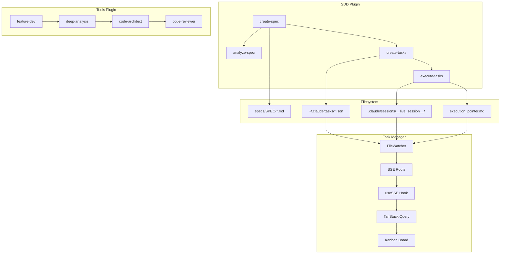
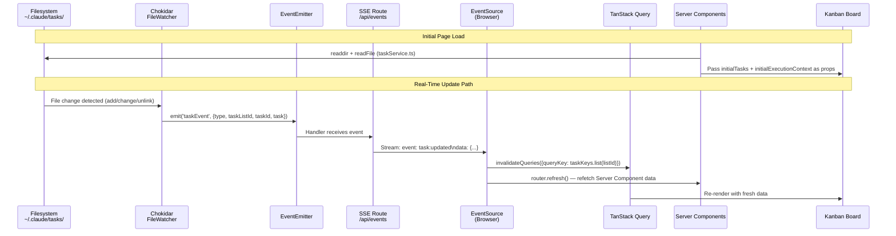
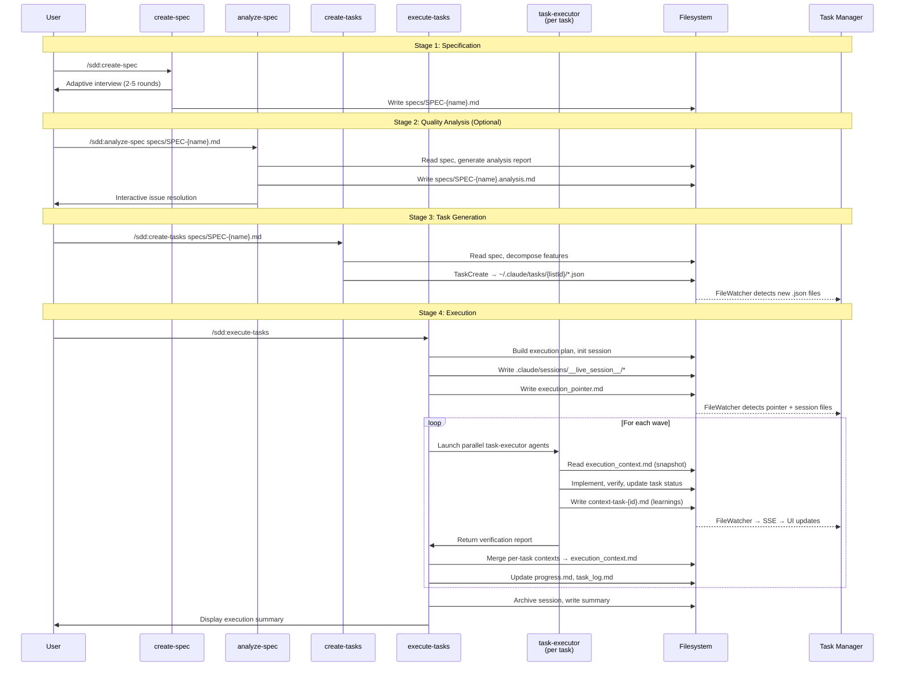
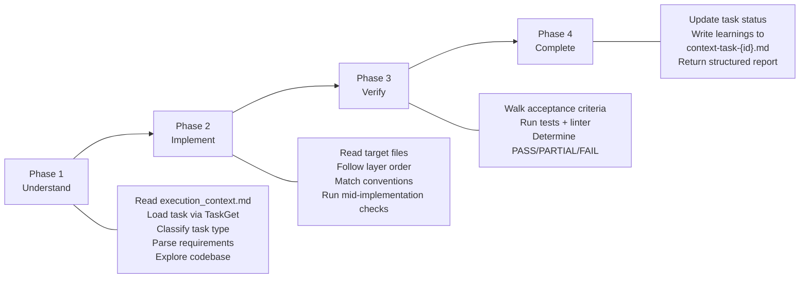
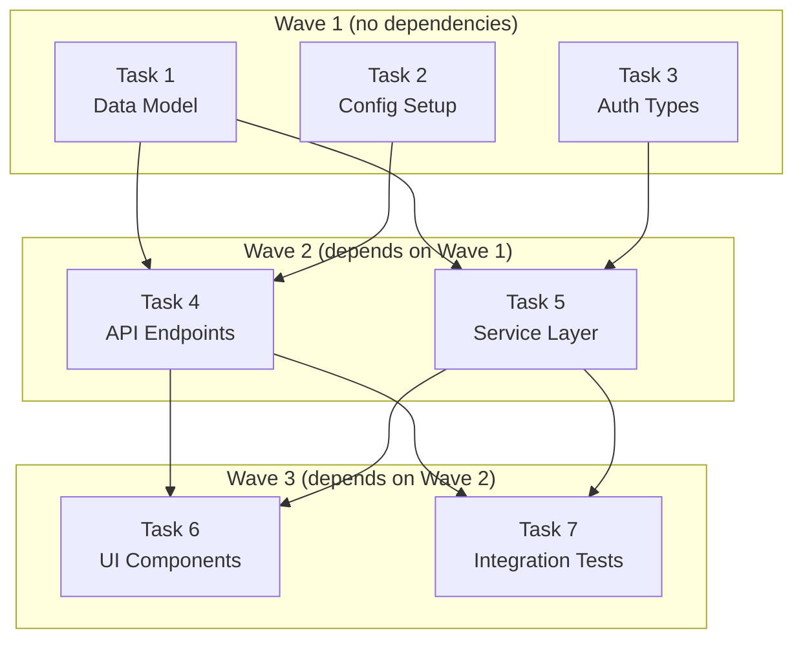
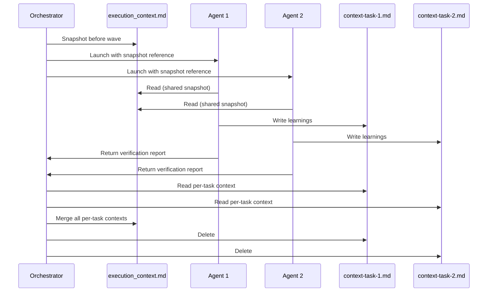
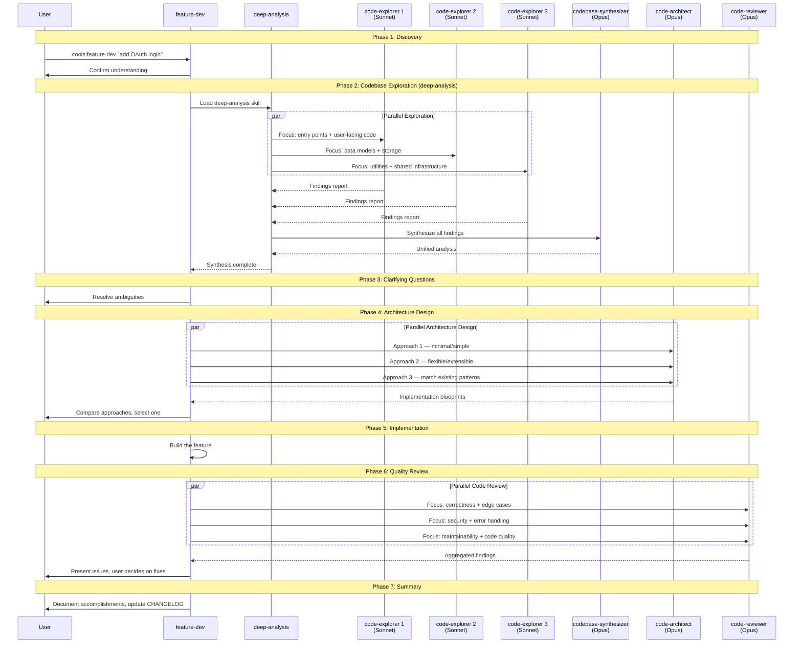
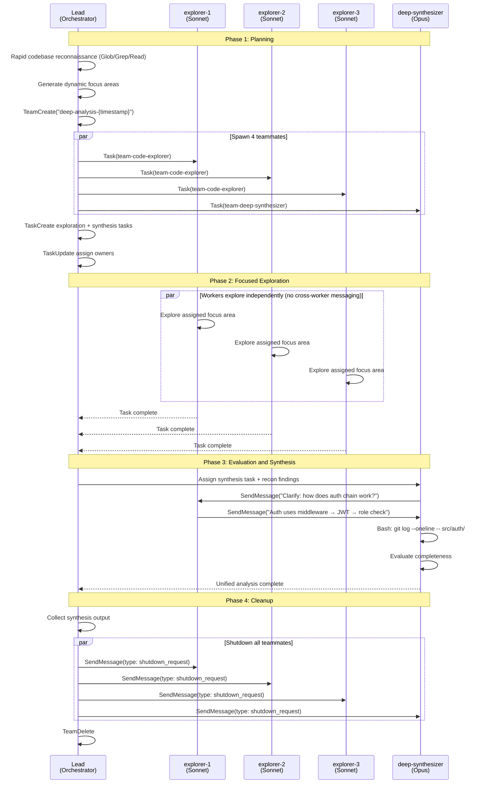
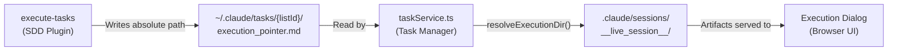

<!-- docs/architecture/data-flow.md -->
# Data Flow

Claude Alchemy operates through three distinct data flow paths that converge on a shared filesystem-as-message-bus integration pattern. Each subsystem -- the SDD plugin pipeline, the Tools plugin agent orchestration, and the Task Manager real-time UI -- reads and writes to `~/.claude/tasks/` as its primary communication channel. No shared runtime code, no database, and no IPC connects these systems; the filesystem is the sole integration boundary.

This page documents every major data flow path, the components involved, and the precise mechanism by which data moves from producer to consumer.

For the underlying integration pattern details, see [Filesystem Message Bus](filesystem-message-bus.md).

---

## Overview



---

## Real-Time Data Flow (Task Manager)

The Task Manager is a Next.js application that renders a Kanban board reflecting the live state of `~/.claude/tasks/`. It uses a Server Component + Client Component hydration pattern where the server reads files for the initial render, then the client subscribes to a Server-Sent Events stream for real-time updates.

### Full Pipeline

```
~/.claude/tasks/*.json
    → Chokidar FileWatcher (polling 300ms)
    → EventEmitter (taskEvent / executionEvent)
    → SSE Route Handler (/api/events)
    → EventSource in browser (useSSE hook)
    → Dual invalidation: TanStack Query cache + router.refresh()
    → UI re-render
```

### Sequence Diagram



### Component Breakdown

=== "FileWatcher (Server)"

    The `FileWatcher` class in `src/lib/fileWatcher.ts` is a Chokidar-based singleton that watches the `~/.claude/tasks/` directory tree. It survives Next.js Hot Module Replacement by attaching to `globalThis`.

    ```typescript title="apps/task-manager/src/lib/fileWatcher.ts"
    // Singleton pattern for HMR survival
    const globalForWatcher = globalThis as unknown as {
      fileWatcher: FileWatcher | undefined
    }

    export const fileWatcher = globalForWatcher.fileWatcher ?? new FileWatcher()

    if (process.env.NODE_ENV !== 'production') {
      globalForWatcher.fileWatcher = fileWatcher
    }
    ```

    **Configuration:**

    | Setting | Value | Purpose |
    |---------|-------|---------|
    | `usePolling` | `true` | Required for cross-platform reliability |
    | `interval` | `300` ms | Balance between responsiveness and CPU usage |
    | `depth` | `2` | Watch `tasks/{listId}/*.json` without excessive recursion |
    | `ignoreInitial` | `true` | Skip events for files that exist at startup |

    **Event Types Emitted:**

    | Event | Trigger | Payload |
    |-------|---------|---------|
    | `taskEvent` | `.json` file added, changed, or deleted | `{ type: SSEEventType, taskListId, taskId, task? }` |
    | `executionEvent` | `.md` or `.txt` file changed in a watched execution directory | `{ type: 'execution:updated', taskListId }` |

    The `watchExecutionDir()` method dynamically adds execution session directories to the watcher when an SSE client connects with a `taskListId` that has an `execution_pointer.md`.

=== "SSE Route Handler (Server)"

    The `/api/events` route in `src/app/api/events/route.ts` creates a `ReadableStream` and subscribes to `FileWatcher` events. It filters events by the `taskListId` query parameter.

    ```typescript title="apps/task-manager/src/app/api/events/route.ts"
    export async function GET(request: Request) {
      const { searchParams } = new URL(request.url)
      const taskListId = searchParams.get('taskListId')

      // Ensure file watcher is started
      if (!fileWatcher.isStarted()) {
        await fileWatcher.start()
      }

      // Watch execution directory for this task list
      if (taskListId) {
        const execDir = await getExecutionDir(taskListId)
        if (execDir) {
          fileWatcher.watchExecutionDir(taskListId, execDir)
        }
      }

      // ... ReadableStream with event handlers
    }
    ```

    **SSE Event Format:**

    ```
    event: task:updated
    data: {"type":"task:updated","taskListId":"claude-alchemy","taskId":"5","task":{...}}

    event: execution:updated
    data: {"type":"execution:updated","taskListId":"claude-alchemy"}
    ```

    A heartbeat comment (`:heartbeat`) is sent every 30 seconds to keep the connection alive. Cleanup removes event listeners on client abort.

=== "useSSE Hook (Client)"

    The `useSSE` hook in `src/hooks/useSSE.ts` opens an `EventSource` connection to `/api/events` and triggers dual invalidation on every event.

    ```typescript title="apps/task-manager/src/hooks/useSSE.ts"
    const handleTaskEvent = () => {
      // Invalidate client-side cache
      queryClient.invalidateQueries({ queryKey: taskKeys.list(taskListId) })
      queryClient.invalidateQueries({ queryKey: taskListKeys.all })
      // Refresh Server Component data
      router.refresh()
    }

    const handleExecutionEvent = () => {
      queryClient.invalidateQueries({
        queryKey: executionContextKeys.list(taskListId),
      })
      router.refresh()
    }
    ```

    **Listened Events:** `task:created`, `task:updated`, `task:deleted`, `execution:updated`

    **Reconnection:** On error, the EventSource closes and a new connection is attempted after a 3-second delay via a `reconnectKey` state increment.

=== "Task Service (Server)"

    The `taskService.ts` module provides the read layer for Server Components. It reads JSON files from `~/.claude/tasks/` and parses them with defensive normalization.

    ```typescript title="apps/task-manager/src/lib/taskService.ts"
    // Defensive parsing: normalize IDs, default status, coerce arrays
    function parseTask(content: string, filename: string): Task | null {
      const data = JSON.parse(content)
      data.id = String(data.id ?? basename(filename, '.json'))
      if (!isValidTaskStatus(data.status)) data.status = 'pending'
      data.blocks = Array.isArray(data.blocks) ? data.blocks.map(String) : []
      data.blockedBy = Array.isArray(data.blockedBy) ? data.blockedBy.map(String) : []
      return data as Task
    }
    ```

    **Security:** `resolveExecutionDir()` guards against path traversal by ensuring the resolved execution pointer path stays under `$HOME` using `path.relative()`.

### Dual Invalidation Strategy

The Task Manager uses two complementary invalidation mechanisms to ensure both Server Component and Client Component data stay synchronized:

| Mechanism | Target | Purpose |
|-----------|--------|---------|
| `queryClient.invalidateQueries()` | TanStack Query cache | Forces client-side data refetch on next access |
| `router.refresh()` | Next.js Server Components | Re-runs server-side data fetching functions |

This dual approach is necessary because:

1. **Server Components** fetch initial data from the filesystem in `page.tsx` and pass it as props
2. **Client Components** use TanStack Query with `initialData` for hydration, then manage their own cache
3. Without `router.refresh()`, Server Component data would go stale after the initial render
4. Without query invalidation, the TanStack Query cache would serve stale data between refetches

---

## SDD Pipeline Flow

The Spec-Driven Development plugin implements a linear pipeline that transforms a user's idea into executed, verified code changes. Each stage produces filesystem artifacts consumed by the next stage.

### Full Pipeline

```
User request
    → create-spec (interview → SPEC file)
    → analyze-spec (optional QA → analysis report)
    → create-tasks (decompose → ~/.claude/tasks/*.json)
    → execute-tasks (10-step orchestrator)
        → spawns task-executor agents (4-phase workflow)
        → shared execution_context.md
        → execution_pointer.md
    → Task Manager (real-time visibility)
```

### Pipeline Sequence



### Stage Details

=== "create-spec"

    **Input:** User's feature idea (via interactive interview)
    **Output:** `specs/SPEC-{name}.md`

    The skill conducts a 2-5 round adaptive interview, adjusting depth based on the user's chosen level (high-level, detailed, or full-tech). It detects recommendation triggers in user responses and offers proactive suggestions. An optional research agent can be dispatched for external information.

    **Key artifacts produced:**

    | Artifact | Path | Purpose |
    |----------|------|---------|
    | Specification | `specs/SPEC-{name}.md` | Requirements with acceptance criteria, phases, dependencies |

=== "analyze-spec"

    **Input:** Path to a spec file
    **Output:** Analysis report + optional spec updates

    The skill launches a `spec-analyzer` agent that evaluates the spec across four categories: inconsistencies, missing information, ambiguities, and structure issues. Severity levels (Critical, Warning, Suggestion) help prioritize fixes.

    **Key artifacts produced:**

    | Artifact | Path | Purpose |
    |----------|------|---------|
    | Analysis report | `specs/SPEC-{name}.analysis.md` | Findings with severity and recommendations |
    | HTML review | `specs/SPEC-{name}.analysis.html` | Interactive browser-based review |

=== "create-tasks"

    **Input:** Path to a spec file
    **Output:** Claude Code native Tasks (JSON files)

    The skill reads the spec, decomposes features into atomic tasks using a layered pattern (Data Model, API/Service, Business Logic, UI, Tests), infers dependency chains via topological analysis, and creates tasks with structured acceptance criteria.

    **Key data transformations:**

    ```
    Spec Section 5.x (Functional Requirements)
        → Features with priorities (P0-P3)
        → Atomic tasks with categorized acceptance criteria
            - Functional, Edge Cases, Error Handling, Performance
        → Dependency graph (blockedBy/blocks relationships)
        → TaskCreate API → ~/.claude/tasks/{listId}/{taskId}.json
    ```

    **Task JSON structure written to disk:**

    ```json
    {
      "id": "1",
      "subject": "Create User data model",
      "description": "...\n\n**Acceptance Criteria:**\n\n_Functional:_\n- [ ] ...",
      "status": "pending",
      "blocks": ["2", "3"],
      "blockedBy": [],
      "activeForm": "Creating User data model",
      "metadata": {
        "priority": "critical",
        "complexity": "S",
        "source_section": "7.3 Data Models",
        "spec_path": "specs/SPEC-Auth.md",
        "feature_name": "User Authentication",
        "task_uid": "specs/SPEC-Auth.md:user-auth:model:001",
        "task_group": "user-authentication"
      }
    }
    ```

=== "execute-tasks"

    **Input:** Task list (all pending/unblocked tasks)
    **Output:** Completed tasks, session artifacts, CLAUDE.md updates

    The 10-step orchestrator builds a dependency-aware execution plan, sorts tasks into waves, and launches up to `max_parallel` (default: 5) task-executor agents simultaneously per wave.

    **Session directory layout (`.claude/sessions/__live_session__/`):**

    | File | Purpose | Updated by |
    |------|---------|------------|
    | `execution_plan.md` | Dependency-sorted plan with wave assignments | Orchestrator (once) |
    | `execution_context.md` | Shared learnings across tasks | Orchestrator (merged after each wave) |
    | `task_log.md` | Table of results: Task ID, Subject, Status, Attempts, Duration, Token Usage | Orchestrator (after each agent returns) |
    | `progress.md` | Real-time status: current wave, active tasks, completed tasks | Orchestrator (between agent launches) |
    | `context-task-{id}.md` | Per-task learnings during concurrent execution | Individual task-executor agents |
    | `.lock` | Concurrency guard (prevents parallel sessions) | Orchestrator (create on start, archive on end) |
    | `tasks/` | Archive of completed task JSONs | Orchestrator (after each wave) |
    | `session_summary.md` | Final execution results | Orchestrator (at session end) |

    **Execution pointer bridge:**

    ```
    ~/.claude/tasks/{listId}/execution_pointer.md
        → Contains: absolute path to .claude/sessions/__live_session__/
        → Read by: Task Manager's taskService.ts → getExecutionDir()
        → Enables: Task Manager to display execution artifacts
    ```

### Task-Executor 4-Phase Workflow

Each task-executor agent follows a strict 4-phase workflow:



**Verification results determine task status:**

| Result | Condition | Task Status |
|--------|-----------|-------------|
| PASS | All Functional criteria pass, tests pass | `completed` |
| PARTIAL | Functional passes but Edge/Error/Performance issues | `in_progress` (orchestrator retries) |
| FAIL | Any Functional criterion fails or tests fail | `in_progress` (orchestrator retries) |

### Wave-Based Concurrency Model

The orchestrator executes tasks in dependency-ordered waves with configurable parallelism:



**Concurrency rules:**

- Tasks within a wave run in parallel (up to `max_parallel` concurrent agents)
- All wave tasks must complete before the next wave starts
- Failed tasks with retries remaining are re-launched immediately within the wave
- After each wave, per-task context files are merged into `execution_context.md`
- Dynamic unblocking: newly unblocked tasks are added to the next wave

### Context Sharing Pattern

During concurrent execution, write contention on `execution_context.md` is avoided through a snapshot-and-merge pattern:



!!! info "Sequential Mode"
    When `max_parallel` is set to 1, agents write directly to `execution_context.md` instead of per-task files. The snapshot-and-merge pattern is skipped.

---

## Tools Plugin Agent Orchestration

The Tools plugin provides two variants of its deep analysis workflow: a standard Task-based approach and a team-based collaborative approach using Agent Teams.

### Standard Deep Analysis Flow

The `feature-dev` skill orchestrates a 7-phase workflow. Phase 2 (Codebase Exploration) delegates to the `deep-analysis` skill, which uses the standard Task tool for agent coordination.



**Agent model tiers:**

| Agent | Model | Role |
|-------|-------|------|
| `code-explorer` | Sonnet (default) | Fast, parallel codebase exploration |
| `codebase-synthesizer` | Opus | Deep analysis and pattern recognition |
| `code-architect` | Opus | Architecture design with trade-off analysis |
| `code-reviewer` | Opus | Thorough code review with confidence scores |

### Team-Based Deep Analysis Flow

When invoked with the `--teams` flag, `feature-dev` uses `teams-deep-analysis` instead of `deep-analysis`. This variant uses Claude's Agent Teams API (`TeamCreate`, `SendMessage`) for real-time inter-agent collaboration.



**Key difference from standard analysis:** The team-based variant adds these capabilities:

| Capability | Standard | Team-Based |
|------------|----------|------------|
| Focus area planning | Static templates | Dynamic, based on codebase reconnaissance |
| Synthesizer follow-ups | Cannot ask explorers questions | Can message explorers directly |
| Deep investigation | Not available | Deep synthesizer has Bash (git history, deps, static analysis) |
| Completeness evaluation | None | Deep synthesizer evaluates coverage before finalizing |
| Team composition | 3 explorers + 1 synthesizer | 3 workers + 1 deep synthesizer |
| Coordination topology | Isolated Task calls | Hub-and-spoke (no cross-worker messaging) |

---

## Cross-System Integration Points

The three subsystems connect through well-defined filesystem interfaces. These are the critical integration points where data crosses system boundaries.

### Execution Pointer Bridge

The `execution_pointer.md` file is the primary bridge between the SDD execution pipeline and the Task Manager:



**Security:** The `resolveExecutionDir()` function validates that the pointer's target path stays under `$HOME`:

```typescript title="apps/task-manager/src/lib/taskService.ts"
function resolveExecutionDir(pointerContent: string): string | null {
  const resolved = raw.startsWith('/') ? resolve(raw) : resolve(home, raw)
  const rel = relative(home, resolved)
  if (rel.startsWith('..') || resolve(home, rel) !== resolved) {
    console.warn(`Execution pointer path escapes home directory: ${raw}`)
    return null
  }
  return resolved
}
```

### Task JSON as Contract

The JSON files in `~/.claude/tasks/{listId}/` serve as the shared data contract between producers (SDD plugin skills) and consumers (Task Manager). Both sides agree on this schema:

| Field | Type | Producer | Consumer |
|-------|------|----------|----------|
| `id` | `string` | `create-tasks` via `TaskCreate` | `taskService.ts` → `parseTask()` |
| `subject` | `string` | `create-tasks` | Kanban card title |
| `description` | `string` | `create-tasks` (with acceptance criteria) | Task detail dialog |
| `status` | `'pending' \| 'in_progress' \| 'completed'` | `execute-tasks` via `TaskUpdate` | Kanban column assignment |
| `blocks` | `string[]` | `create-tasks` via `TaskUpdate` | Dependency visualization |
| `blockedBy` | `string[]` | `create-tasks` via `TaskUpdate` | Dependency visualization |
| `activeForm` | `string?` | `create-tasks` | In-progress display text |
| `metadata` | `object?` | `create-tasks` | Priority badge, complexity tag |

### Progress.md Real-Time Bridge

The `progress.md` file provides real-time execution visibility to the Task Manager:

```
execute-tasks orchestrator
    → Updates progress.md (wave status, active tasks, completed tasks)
    → Chokidar detects .md change in watched execution directory
    → executionEvent emitted
    → SSE streams execution:updated event
    → useSSE invalidates executionContextKeys
    → useExecutionContext refetches
    → parseProgressMd() extracts structured progress
    → ExecutionProgressBar + ExecutionDialog re-render
```

**Parsed progress structure:**

```typescript title="apps/task-manager/src/types/execution.ts"
interface ExecutionProgress {
  status: string           // "Executing", "Complete", etc.
  wave: number             // Current wave number
  totalWaves: number       // Total planned waves
  maxParallel?: number     // Concurrent agent limit
  updated: string          // ISO 8601 timestamp
  activeTasks: ActiveTask[]      // Currently executing
  completedTasks: CompletedTask[] // Finished this session
}
```

---

## Data Flow Summary Table

| Flow | Producer | Artifact | Consumer | Mechanism |
|------|----------|----------|----------|-----------|
| Spec creation | `create-spec` | `specs/SPEC-*.md` | `analyze-spec`, `create-tasks` | File read |
| Spec analysis | `analyze-spec` | `.analysis.md`, `.analysis.html` | User (browser) | File read |
| Task generation | `create-tasks` | `~/.claude/tasks/{listId}/*.json` | `execute-tasks`, Task Manager | TaskCreate API, Chokidar |
| Task status updates | `execute-tasks` | Task JSON `status` field | Task Manager | TaskUpdate API, Chokidar |
| Execution session | `execute-tasks` | `.claude/sessions/__live_session__/*` | Task Manager, task-executor agents | File write, Chokidar |
| Execution pointer | `execute-tasks` | `execution_pointer.md` | Task Manager (`getExecutionDir`) | File write, file read |
| Shared context | task-executor agents | `context-task-{id}.md` | Orchestrator (merge) | File write, file read |
| Real-time progress | `execute-tasks` | `progress.md` | Task Manager (`parseProgressMd`) | File write, Chokidar, SSE |
| Exploration findings | code-explorer agents | Task tool response | codebase-synthesizer | In-memory (Task tool) |
| Team collaboration | team-code-explorer | `SendMessage` | Other team members | Agent Teams API |
