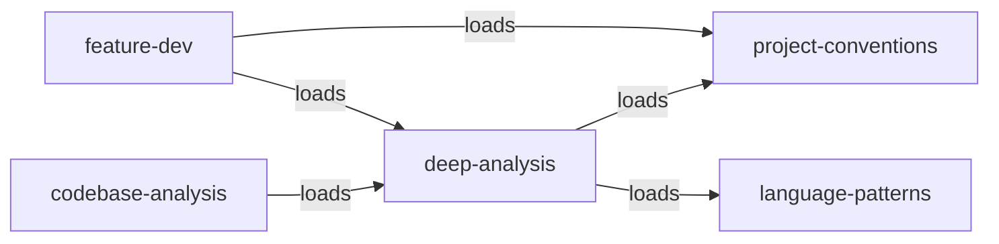
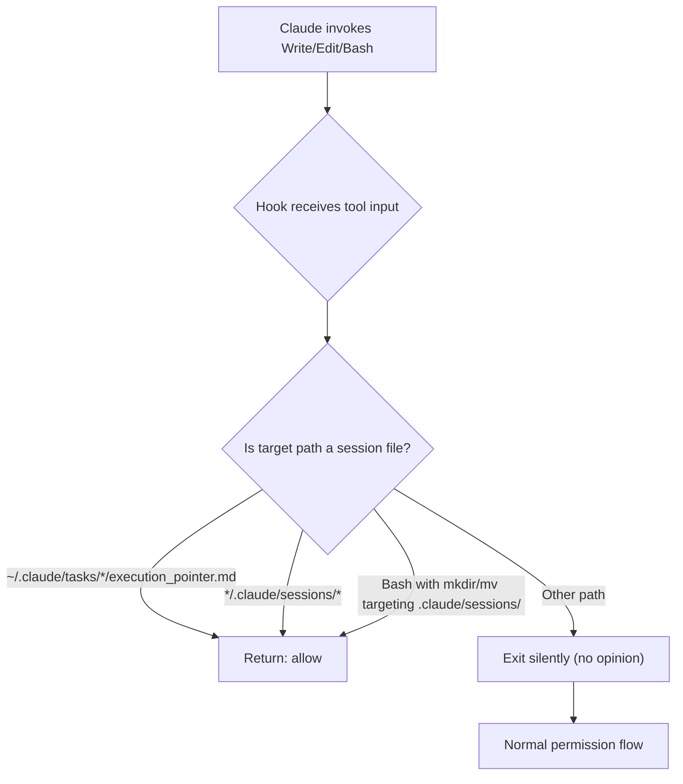
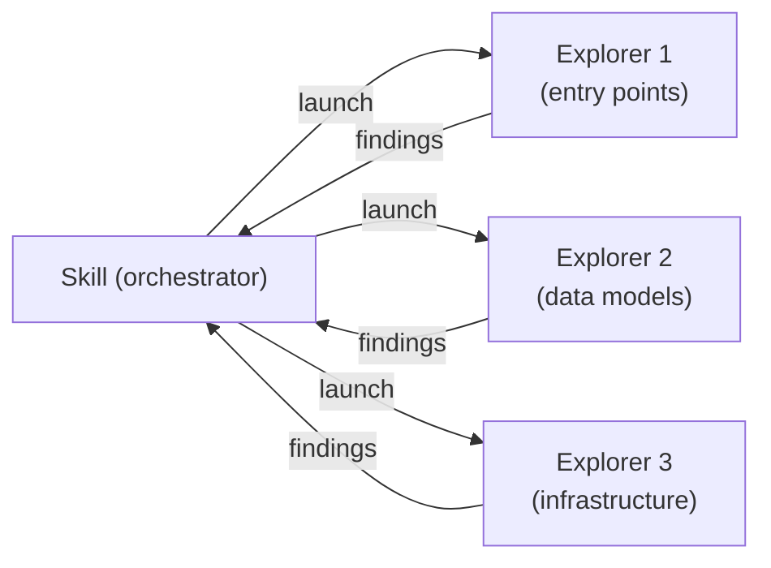
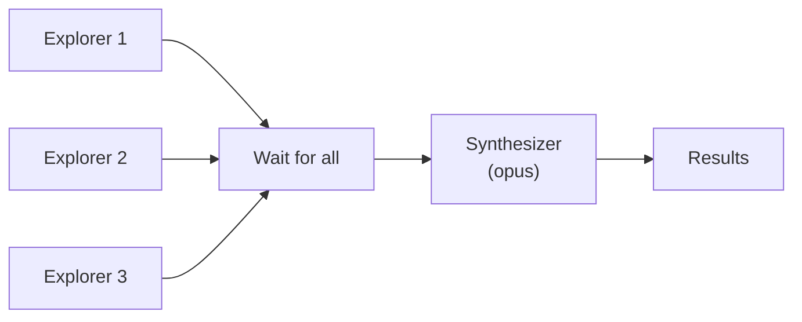
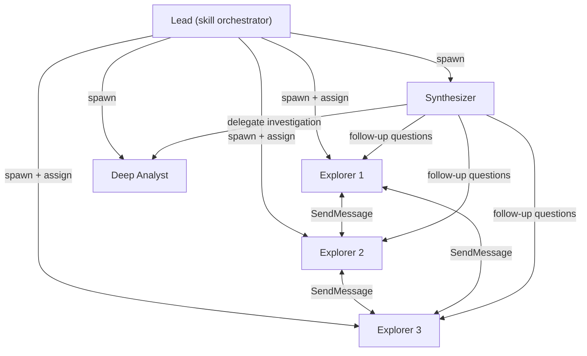
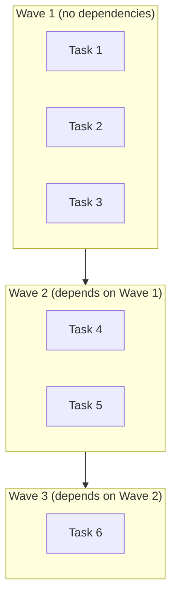

<!-- docs/plugins/overview.md -->
# Plugin System Overview

Claude Alchemy ships two Claude Code plugins that extend Claude's capabilities with structured workflows, specialized agents, and event-driven automation. Both plugins are **markdown-only** -- they have no `package.json`, no build step, and no runtime dependencies. Claude Code loads them as context at conversation start and interprets their instructions directly.

This page covers the core concepts that both plugins share. For plugin-specific details, see [Tools Plugin](tools-plugin.md) and [SDD Plugin](sdd-plugin.md).

## The Two Plugins

| Plugin | Version | Agents | Skills | Prefix | Purpose |
|--------|---------|--------|--------|--------|---------|
| `claude-alchemy-tools` | 0.2.2 | 10 | 13 | `/tools:` | Feature development, codebase analysis, documentation, Git, releases |
| `claude-alchemy-sdd` | 0.2.6 | 2 | 4 | `/sdd:` | Spec-driven development: spec creation, analysis, task decomposition, autonomous execution |

Both plugins live under `plugins/` in the monorepo but are **excluded from the pnpm workspace**. They are pure markdown -- no `node_modules`, no compilation, no transpilation.

```
plugins/
├── tools/                      # claude-alchemy-tools
│   ├── agents/                 # 10 agent definitions
│   ├── skills/                 # 13 skill definitions
│   ├── .claude-plugin/
│   │   └── plugin.json         # Plugin manifest
│   └── README.md
└── sdd/                        # claude-alchemy-sdd
    ├── agents/                 # 2 agent definitions
    ├── skills/                 # 4 skill definitions
    ├── hooks/                  # Event-driven automation
    │   ├── hooks.json          # Hook configuration
    │   └── auto-approve-session.sh
    ├── .claude-plugin/
    │   └── plugin.json         # Plugin manifest
    └── README.md
```

## Core Concepts

The plugin system is built on four primitives: **skills**, **agents**, **hooks**, and **plugin manifests**. Skills are user-facing workflows. Agents are specialized sub-processes that skills launch to do focused work. Hooks automate permission decisions. Manifests track plugin metadata and versions.

### Skills

A skill is a `SKILL.md` file inside a `skills/{skill-name}/` directory. It contains YAML frontmatter with metadata followed by a markdown body with instructions, workflow phases, and behavioral guidelines. Skills are the primary user-facing interface to the plugin system.

#### Invocation

Users invoke skills with the plugin prefix and skill name:

```
/tools:feature-dev implement user authentication with OAuth2
/tools:git-commit
/sdd:create-spec
/sdd:execute-tasks --max-parallel 3
```

The text after the skill name is passed as `$ARGUMENTS` and can include flags like `--teams` or `--max-parallel`.

#### Frontmatter Schema

Every `SKILL.md` starts with YAML frontmatter that defines the skill's metadata:

```yaml title="plugins/tools/skills/feature-dev/SKILL.md"
---
name: feature-dev
description: Feature development workflow with exploration, architecture, implementation, and review phases.
argument-hint: <feature-description> [--teams]
model: inherit
user-invocable: true
disable-model-invocation: false
allowed-tools: Read, Write, Edit, Glob, Grep, Bash, Task, AskUserQuestion
---
```

| Field | Type | Description |
|-------|------|-------------|
| `name` | string | Skill identifier used in invocation (`/tools:{name}`) |
| `description` | string | What the skill does and when to use it |
| `argument-hint` | string | Shows users what arguments the skill accepts |
| `model` | string | Model to run the skill with (`opus`, `sonnet`, `haiku`, or `inherit`) |
| `user-invocable` | boolean | Whether users can invoke this skill directly |
| `disable-model-invocation` | boolean | Whether Claude can invoke this skill autonomously |
| `allowed-tools` | list | Tools the skill is permitted to use |
| `arguments` | list | Structured argument definitions with `name`, `description`, `required` |

#### Skill Categories

Skills fall into two categories based on their `user-invocable` flag:

=== "User-Invocable Skills"

    These are the primary entry points. Users invoke them directly to trigger workflows.

    | Plugin | Skill | Model | Description |
    |--------|-------|-------|-------------|
    | tools | `feature-dev` | inherit | 7-phase feature development workflow |
    | tools | `codebase-analysis` | inherit | Structured codebase exploration and analysis |
    | tools | `docs-manager` | inherit | Documentation management for MkDocs and standalone markdown |
    | tools | `deep-analysis` | inherit | Reusable exploration + synthesis workflow |
    | tools | `teams-deep-analysis` | inherit | Team-based collaborative analysis with Agent Teams |
    | tools | `git-commit` | haiku | Conventional commit message generation |
    | tools | `release` | haiku | Package release preparation and verification |
    | tools | `bump-plugin-version` | haiku | Plugin version bumping in manifest files |
    | sdd | `create-spec` | inherit | Interactive specification creation |
    | sdd | `analyze-spec` | inherit | Spec quality analysis and issue detection |
    | sdd | `create-tasks` | inherit | Spec decomposition into Claude Code Tasks |
    | sdd | `execute-tasks` | inherit | Autonomous wave-based parallel task execution |

=== "Supporting Skills"

    These are building blocks loaded by other skills at runtime. They provide domain knowledge and pattern guidance rather than standalone workflows.

    | Plugin | Skill | Description |
    |--------|-------|-------------|
    | tools | `architecture-patterns` | Architectural pattern knowledge (MVC, event-driven, CQRS) |
    | tools | `language-patterns` | Language-specific idioms and best practices |
    | tools | `project-conventions` | Project convention detection and enforcement |
    | tools | `code-quality` | Code quality review standards |
    | tools | `changelog-format` | Keep a Changelog formatting guidelines |

#### Reference Materials

Skills can include reference materials in a `references/` subdirectory alongside `SKILL.md`. These are markdown files loaded at runtime to provide templates, examples, and domain knowledge:

```
skills/create-spec/
├── SKILL.md
└── references/
    ├── interview-questions.md
    ├── recommendation-format.md
    ├── recommendation-triggers.md
    └── templates/
        ├── detailed.md
        ├── full-tech.md
        └── high-level.md
```

Skills load references using the `${CLAUDE_PLUGIN_ROOT}` variable:

```markdown
Read `${CLAUDE_PLUGIN_ROOT}/skills/create-spec/references/interview-questions.md`
```

#### Skill Composition

Skills can load other skills as reusable building blocks. The calling skill reads the target `SKILL.md` and follows its workflow inline. For example, `feature-dev` loads `deep-analysis` for its codebase exploration phase:



This composition pattern avoids duplicating workflow logic across skills. Changes to `deep-analysis` automatically propagate to every skill that loads it.

---

### Agents

An agent is a `{kebab-case-name}.md` file in the `agents/` directory. Agents are specialized sub-processes that skills spawn via Claude Code's `Task` tool to perform focused work. Each agent has a narrow scope, a specific model tier, and a constrained tool set.

#### Frontmatter Schema

```yaml title="plugins/tools/agents/code-explorer.md"
---
description: Explores codebases to find relevant files, trace execution paths, and map architecture
tools:
  - Read
  - Glob
  - Grep
  - Bash
model: sonnet
skills:
  - project-conventions
  - language-patterns
---
```

| Field | Type | Description |
|-------|------|-------------|
| `description` | string | What the agent does |
| `tools` | list | Tools the agent is permitted to use |
| `model` | string | Model tier for this agent (`opus`, `sonnet`, `haiku`, or `inherit`) |
| `skills` | list | Supporting skills the agent can access |

#### Agent Inventory

=== "Tools Plugin Agents"

    | Agent | Model | Tools | Purpose |
    |-------|-------|-------|---------|
    | `code-explorer` | sonnet | Read, Glob, Grep, Bash | Explore codebases to find relevant files and map architecture |
    | `code-architect` | inherit | Read, Glob, Grep | Design implementation blueprints from exploration findings |
    | `code-reviewer` | inherit | Read, Glob, Grep | Review code for correctness, security, and maintainability |
    | `codebase-synthesizer` | inherit | Read, Glob, Grep | Merge findings from multiple code-explorer agents |
    | `docs-writer` | inherit | Read, Glob, Grep, Bash | Generate MkDocs or GitHub-flavored Markdown documentation |
    | `researcher` | inherit | (web tools) | Research technical docs via web search and Context7 |
    | `changelog-agent` | (default) | Bash, Read, Edit, Glob, Grep | Analyze git history and update CHANGELOG.md |
    | `team-code-explorer` | sonnet | Read, Glob, Grep, Bash, SendMessage, TaskUpdate, TaskGet, TaskList | Code explorer with team communication capabilities |
    | `team-deep-synthesizer` | inherit | Read, Glob, Grep, Bash, SendMessage, TaskUpdate, TaskGet, TaskList | Synthesizer with deep investigation (Bash, git history) and completeness evaluation |

=== "SDD Plugin Agents"

    | Agent | Model | Tools | Purpose |
    |-------|-------|-------|---------|
    | `task-executor` | inherit | Read, Write, Edit, Glob, Grep, Bash, TaskGet, TaskUpdate, TaskList | Execute a single task through understand-implement-verify-complete phases |
    | `spec-analyzer` | inherit | AskUserQuestion, Read, Write, Edit, Glob, Grep | Analyze specs for quality issues and guide interactive resolution |

#### Model Tiering

Agents are assigned to model tiers based on the cognitive demands of their work:

| Model | Cost | When to Use | Examples |
|-------|------|-------------|---------|
| `opus` | Highest | Complex reasoning, synthesis, architecture design | `codebase-synthesizer`, `team-deep-synthesizer` |
| `sonnet` | Medium | Exploration, pattern detection, broad search | `code-explorer`, `team-code-explorer` |
| `haiku` | Lowest | Mechanical, procedural tasks with clear rules | `git-commit`, `bump-plugin-version` |
| `inherit` | Varies | Use the parent session's model | `code-architect`, `researcher`, `task-executor` |

!!! tip "Cost Optimization"
    Model tiering is a deliberate cost optimization strategy. Exploratory work that benefits from breadth (scanning many files) uses the faster, cheaper `sonnet`. Synthesis work that requires depth (merging findings, designing architecture) uses the more capable `opus`. Simple procedural tasks that follow rigid rules use the cheapest `haiku`.

#### Spawning Agents

Skills spawn agents using the `Task` tool with the `subagent_type` parameter. The agent type follows the format `{plugin-name}:{agent-name}`:

```markdown
Launch a code-explorer agent using the Task tool:
- subagent_type: "claude-alchemy-tools:code-explorer"
- model: "sonnet"
- prompt: "Explore entry points and user-facing code at /path/to/project..."
```

For team-based agents, the `team_name` parameter is also required to join the agent to a team:

```markdown
Launch a team-code-explorer agent:
- subagent_type: "claude-alchemy-tools:team-code-explorer"
- model: "sonnet"
- team_name: "deep-analysis-1707300000"
- prompt: "You are part of a deep analysis team..."
```

---

### Hooks

Hooks provide event-driven automation by running shell scripts in response to Claude Code tool invocations. They are defined in a `hooks/hooks.json` file within the plugin directory.

#### Hook Configuration

```json title="plugins/sdd/hooks/hooks.json"
{
  "description": "Auto-approve file operations for execute-tasks session management",
  "hooks": {
    "PreToolUse": [
      {
        "matcher": "Write|Edit|Bash",
        "hooks": [
          {
            "type": "command",
            "command": "bash ${CLAUDE_PLUGIN_ROOT}/hooks/auto-approve-session.sh",
            "timeout": 5
          }
        ]
      }
    ]
  }
}
```

| Field | Description |
|-------|-------------|
| `PreToolUse` / `PostToolUse` | Event type -- fires before or after a tool is invoked |
| `matcher` | Regex pattern matching tool names (e.g., `Write\|Edit\|Bash`) |
| `type` | Hook type -- currently only `command` is supported |
| `command` | Shell command to execute. `${CLAUDE_PLUGIN_ROOT}` resolves to the plugin directory |
| `timeout` | Maximum execution time in seconds |

#### How the Auto-Approve Hook Works

The SDD plugin's `auto-approve-session.sh` hook enables the `execute-tasks` skill to write session files without prompting the user for permission on every file operation. The hook receives the tool invocation as JSON on stdin and returns a permission decision:



!!! warning "Scope Limitation"
    The auto-approve hook only approves operations on session-related paths. All other file operations fall through to Claude Code's normal permission flow, where the user is prompted for approval.

---

### Plugin Manifests

Each plugin has its own `plugin.json` manifest, and a root-level `marketplace.json` tracks all plugins. Both files must be kept in sync when versions change.

=== "Plugin Manifest"

    ```json title="plugins/tools/.claude-plugin/plugin.json"
    {
      "name": "claude-alchemy-tools",
      "version": "0.2.2",
      "description": "Developer tools for feature development, Git workflows, and release automation",
      "author": {
        "name": "Stephen Sequenzia",
        "email": "sequenzia@gmail.com",
        "url": "https://sequenzia.com"
      },
      "homepage": "https://github.com/sequenzia/claude-alchemy/tree/main/plugins/tools",
      "repository": "https://github.com/sequenzia/claude-alchemy/tree/main/plugins/tools",
      "license": "MIT",
      "keywords": ["claude-code", "agents", "skills", "hooks", "workflow", "automation"]
    }
    ```

=== "Marketplace Registry"

    ```json title=".claude-plugin/marketplace.json"
    {
      "name": "claude-alchemy",
      "description": "Custom plugins for Claude Alchemy",
      "plugins": [
        {
          "name": "claude-alchemy-tools",
          "version": "0.2.2",
          "source": "./plugins/tools/",
          "category": "development"
        },
        {
          "name": "claude-alchemy-sdd",
          "version": "0.2.6",
          "source": "./plugins/sdd/",
          "category": "development"
        }
      ]
    }
    ```

!!! info "Version Synchronization"
    The `version` field must match between `plugin.json` and the corresponding entry in `marketplace.json`. The `/tools:bump-plugin-version` skill handles this automatically -- it updates both files in a single operation.

---

## Agent Orchestration Patterns

Skills use several orchestration patterns to coordinate agents. The choice of pattern depends on the nature of the work: independent exploration benefits from parallelism, while synthesis requires sequential dependencies.

### Parallel Exploration

Multiple agents are launched simultaneously, each with a distinct focus area to minimize overlap. The skill waits for all agents to complete before proceeding.



**Used by:** `deep-analysis`, `teams-deep-analysis`, `feature-dev`, `codebase-analysis`

The `deep-analysis` skill launches 2-3 `code-explorer` agents in parallel, each assigned a focus area like "entry points and user-facing code", "data models and storage", or "utilities and shared infrastructure". The skill waits for all agents to report back, then passes their combined findings to a synthesizer.

### Sequential Pipeline

The output of one phase becomes the input of the next. A synthesizer agent only starts after all explorers have completed.



**Used by:** `deep-analysis`, `codebase-analysis`

This pattern combines parallel exploration with sequential synthesis. The synthesizer reads all exploration reports, merges duplicates, resolves conflicts, and produces a unified analysis. The synthesizer uses `opus` for its deeper reasoning capabilities.

### Team Collaboration

Agent Teams enable real-time inter-agent communication via `SendMessage`. Explorers share discoveries with each other as they work, and the synthesizer can ask follow-up questions to resolve conflicts.



**Used by:** `teams-deep-analysis`

The team-based workflow creates a named team with 5 agents: 3 explorers, 1 synthesizer, and 1 deep analyst. Explorers proactively share significant discoveries (shared utilities, unexpected integration points, cross-cutting patterns) with their teammates via `SendMessage`. The synthesizer can ask explorers follow-up questions to clarify conflicts. The deep analyst activates on demand for complex investigations that require `Bash` access (git history, dependency trees, static analysis).

### Wave-Based Concurrency

Tasks are organized into dependency-based waves using topological sorting. Within each wave, up to `max_parallel` agents execute simultaneously. The next wave starts only after the current wave completes.



**Used by:** `execute-tasks`

The `execute-tasks` skill builds a dependency graph from task `blockedBy` relationships and assigns tasks to waves via topological sort. Wave 1 contains all tasks with no dependencies, Wave 2 contains tasks that depend only on Wave 1 tasks, and so on. Within each wave, tasks are sorted by priority (`critical` > `high` > `medium` > `low`) and by how many other tasks they unblock. If a wave exceeds `max_parallel`, it splits into sub-waves.

Each task in a wave is executed by a dedicated `task-executor` agent that follows a 4-phase workflow: Understand, Implement, Verify, Complete. Agents share learnings across tasks through a shared `execution_context.md` file.

---

## Plugin Directory Layout

Both plugins follow the same structural conventions:

```
plugins/{name}/
├── agents/
│   └── {agent-name}.md            # Agent definition (kebab-case filename)
├── skills/
│   └── {skill-name}/
│       ├── SKILL.md                # Skill definition with YAML frontmatter
│       └── references/             # Optional: reference materials loaded at runtime
│           ├── template.md
│           └── examples.md
├── hooks/                          # Optional: event-driven automation
│   ├── hooks.json                  # Hook configuration
│   └── *.sh                        # Hook scripts
├── .claude-plugin/
│   └── plugin.json                 # Plugin manifest (name, version, metadata)
└── README.md                       # Plugin documentation
```

!!! note "Naming Conventions"
    - **Plugin names**: `claude-alchemy-{category}` (e.g., `claude-alchemy-tools`, `claude-alchemy-sdd`)
    - **Skill directories**: kebab-case matching the `name` field in `SKILL.md` (e.g., `feature-dev/`, `git-commit/`)
    - **Agent files**: kebab-case with `.md` extension (e.g., `code-explorer.md`, `task-executor.md`)
    - **Skill definitions**: Always named `SKILL.md` (uppercase)

## Runtime Variables

Plugins have access to these variables at runtime:

| Variable | Description | Example |
|----------|-------------|---------|
| `${CLAUDE_PLUGIN_ROOT}` | Absolute path to the plugin root directory | `/path/to/plugins/tools` |
| `$ARGUMENTS` | Raw text passed after the skill name during invocation | `implement auth --teams` |

Skills use `${CLAUDE_PLUGIN_ROOT}` to load reference materials and compose other skills:

```markdown
Read `${CLAUDE_PLUGIN_ROOT}/skills/deep-analysis/SKILL.md` and follow its workflow.
```

## Related Pages

- [Tools Plugin](tools-plugin.md) -- Detailed reference for all tools plugin skills and agents
- [SDD Plugin](sdd-plugin.md) -- Detailed reference for the spec-driven development plugin
- [SDD Workflow](sdd-workflow.md) -- End-to-end walkthrough of the SDD lifecycle
- [Architecture Overview](../architecture/overview.md) -- High-level system architecture including plugins
