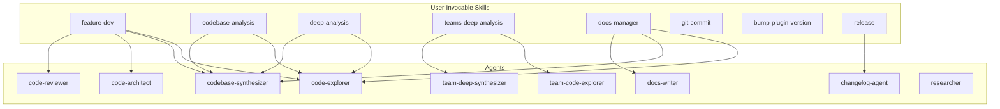

<!-- docs/plugins/tools-plugin.md -->
# Tools Plugin

**claude-alchemy-tools v0.2.2** --- General developer skills and agents for codebase analysis, feature development, documentation management, Git workflows, and release automation.

## Overview

The Tools Plugin provides 8 user-invocable skills, 5 supporting skills, and 10 specialized agents that work together to automate common development workflows. Skills orchestrate agents via the Task tool with model tiering --- lightweight tasks run on Haiku, exploration on Sonnet, and synthesis/architecture/review work on Opus.



---

## Installation

The plugin is located at `plugins/tools/` within the Claude Alchemy monorepo. It requires no build step --- skills are Markdown files with YAML frontmatter, and agents are standalone Markdown definitions.

All skills are invoked with the `/tools:` prefix:

```
/tools:skill-name [arguments]
```

---

## User-Invocable Skills

These skills are triggered directly by the user via the `/tools:` prefix.

### feature-dev

!!! info "Model: inherit | Invocation: `/tools:feature-dev <feature-description> [--teams]`"

A comprehensive 7-phase feature development workflow that guides a feature from understanding through implementation and review.

**Phases:**

| # | Phase | Description |
|---|-------|-------------|
| 1 | Discovery | Analyze feature requirements and confirm understanding with the user |
| 2 | Codebase Exploration | Run `deep-analysis` (or `teams-deep-analysis` with `--teams`) to map relevant code |
| 3 | Clarifying Questions | Resolve ambiguities that would impact implementation |
| 4 | Architecture Design | Launch 2--3 `code-architect` agents with different approaches, present trade-offs, user selects, and an ADR is generated |
| 5 | Implementation | Build the feature following the chosen architecture design |
| 6 | Quality Review | Launch 3 `code-reviewer` agents (correctness, security, maintainability) with confidence-scored findings (>=80 threshold) |
| 7 | Summary | Document accomplishments and update CHANGELOG.md |

**Agents spawned:** `code-explorer` (Sonnet), `codebase-synthesizer` (Opus), `code-architect` (Opus), `code-reviewer` (Opus)

**Supporting skills loaded:** `project-conventions`, `language-patterns`, `architecture-patterns`, `code-quality`, `changelog-format`

!!! example "Usage"

    ```
    /tools:feature-dev Add OAuth2 login flow with Google and GitHub providers
    /tools:feature-dev Add dark mode toggle --teams
    ```

---

### codebase-analysis

!!! info "Model: inherit | Invocation: `/tools:codebase-analysis <analysis-context> [--teams]`"

A 3-phase structured codebase analysis workflow that explores the codebase, presents a detailed report, and offers post-analysis actions.

**Phases:**

| # | Phase | Description |
|---|-------|-------------|
| 1 | Deep Analysis | Run `deep-analysis` (or `teams-deep-analysis` with `--teams`) for exploration and synthesis |
| 2 | Reporting | Present structured report: executive summary, architecture overview, critical files, patterns, risks, recommendations |
| 3 | Post-Analysis Actions | Multi-select menu: save report, update README/CLAUDE.md, retain summary in memory, address actionable insights |

The post-analysis "Address Actionable Insights" action extracts challenges and recommendations from the report, ranks them by severity, and lets the user select which ones to fix --- spawning `code-architect` or `code-explorer` agents as needed for complex items.

**Agents spawned:** `code-explorer` (Sonnet), `codebase-synthesizer` (Opus)

!!! example "Usage"

    ```
    /tools:codebase-analysis authentication and authorization flow
    /tools:codebase-analysis --teams
    ```

---

### deep-analysis

!!! info "Model: inherit | Invocation: `/tools:deep-analysis <analysis-context>`"

A reusable exploration and synthesis building block. Launches parallel `code-explorer` agents to investigate distinct focus areas, then merges findings with a `codebase-synthesizer` agent. Other skills (like `feature-dev` and `codebase-analysis`) load this skill as an internal workflow step.

**Workflow:**

1. Determine focus areas (2--3 agents depending on scope)
2. Launch `code-explorer` agents in parallel with distinct focus areas
3. Wait for all explorers to complete
4. Launch `codebase-synthesizer` to merge, deduplicate, and deepen the analysis
5. Return synthesized results (standalone: present to user; loaded by another skill: return control)

**Agents spawned:** `code-explorer` (Sonnet, 2--3 instances), `codebase-synthesizer` (Opus)

**Supporting skills loaded:** `project-conventions`, `language-patterns`

!!! example "Usage"

    ```
    /tools:deep-analysis real-time data synchronization layer
    /tools:deep-analysis
    ```

---

### teams-deep-analysis

!!! info "Model: inherit | Invocation: `/tools:teams-deep-analysis <analysis-context>`"

A team-based variant of `deep-analysis` that uses Agent Teams with hub-and-spoke coordination. The lead performs rapid codebase reconnaissance to generate dynamic focus areas, workers explore independently (no cross-worker messaging), and a deep synthesizer merges findings with Bash-powered investigation and completeness evaluation.

**Phases:**

| # | Phase | Description |
|---|-------|-------------|
| 1 | Planning | Codebase reconnaissance, generate dynamic focus areas, create team, spawn 4 teammates, assign tasks |
| 2 | Focused Exploration | Workers explore assigned areas independently (no cross-worker messaging) |
| 3 | Evaluation and Synthesis | Verify completeness, launch deep synthesizer with recon findings and Bash access |
| 4 | Completion + Cleanup | Collect results, present or return, shut down all teammates, delete team |

**Agents spawned:** `team-code-explorer` (Sonnet, 3 instances), `team-deep-synthesizer` (Opus)

**Supporting skills loaded:** `project-conventions`, `language-patterns`

!!! tip "When to use teams"
    Use the `--teams` flag (or invoke this skill directly) when analyzing large or complex codebases where inter-agent collaboration and follow-up questions would improve analysis depth. For simpler codebases, the standard `deep-analysis` is faster and uses fewer resources.

!!! example "Usage"

    ```
    /tools:teams-deep-analysis microservices communication patterns
    ```

---

### docs-manager

!!! info "Model: inherit | Invocation: `/tools:docs-manager <action-or-description> [--teams]`"

A 6-phase documentation management workflow that supports three documentation formats and multiple action types.

**Supported documentation types:**

| Type | Output | Examples |
|------|--------|---------|
| MkDocs site | Material for MkDocs pages under `docs/` | API reference, architecture guides, getting started |
| Basic Markdown | Standalone GFM files | README.md, CONTRIBUTING.md, ARCHITECTURE.md |
| Change Summary | Changelog entries, release notes | Markdown changelog, commit message, MkDocs page |

**Phases:**

| # | Phase | Description |
|---|-------|-------------|
| 1 | Interactive Discovery | Determine doc type, format, and scope through user interaction |
| 2 | Project Detection & Setup | Detect project metadata, check existing docs, conditionally scaffold MkDocs |
| 3 | Codebase Analysis | Run `deep-analysis` for documentation-focused exploration (skipped for change summaries) |
| 4 | Documentation Planning | Translate findings into a concrete plan with page list, outlines, and nav structure |
| 5 | Documentation Generation | Launch `docs-writer` agents --- parallel for independent pages, sequential for dependent pages |
| 6 | Integration & Finalization | Write files, validate cross-references, present results |

**Agents spawned:** `code-explorer` (Sonnet), `codebase-synthesizer` (Opus), `docs-writer` (Opus)

**Reference materials:** `mkdocs-config-template.md`, `change-summary-templates.md`, `markdown-file-templates.md`

!!! example "Usage"

    ```
    /tools:docs-manager create MkDocs documentation site
    /tools:docs-manager write README and CONTRIBUTING
    /tools:docs-manager changelog since last tag
    /tools:docs-manager update API docs --teams
    ```

---

### git-commit

!!! info "Model: haiku | Invocation: `/tools:git-commit`"

Stages all changes, analyzes the diff, and generates a conventional commit message. Runs on Haiku for speed and cost efficiency.

**Workflow:**

1. Check repository state (`git status`)
2. Stage all changes (`git add .`)
3. Analyze the staged diff to determine type, scope, and description
4. Construct a conventional commit message (imperative mood, lowercase, under 72 characters)
5. Create the commit
6. Report the result (or handle pre-commit hook failures)

**Commit types:** `feat`, `fix`, `docs`, `style`, `refactor`, `test`, `chore`, `build`, `ci`, `perf`

!!! warning "Stages all changes"
    This skill runs `git add .` before committing. All untracked files and modifications will be included. Review your working directory before invoking.

!!! example "Usage"

    ```
    /tools:git-commit
    ```

---

### bump-plugin-version

!!! info "Model: haiku | Invocation: `/tools:bump-plugin-version`"

Discovers all plugins in the repository, prompts the user to select one and choose a bump level, then updates both the plugin's `plugin.json` and the root `marketplace.json`.

**Workflow:**

1. Discover plugins by scanning `plugins/*/` directories
2. Present plugins with current versions for user selection
3. Prompt for bump level: patch, minor, or major
4. Calculate the new version using semver rules
5. Update `plugins/{name}/.claude-plugin/plugin.json`
6. Update `.claude-plugin/marketplace.json`

!!! example "Usage"

    ```
    /tools:bump-plugin-version
    ```

---

### release

!!! info "Model: haiku | Invocation: `/tools:release [version-override]`"

A Python release workflow with pre-flight checks, automated tests, version calculation from CHANGELOG.md, and git tag creation. Uses `uv` and `ruff` for Python tooling.

**Workflow (9 steps, fail-fast):**

| # | Step | Description |
|---|------|-------------|
| 1 | Pre-flight Checks | Must be on `main`, clean working directory, pull latest |
| 2 | Run Tests | `uv run pytest` |
| 3 | Run Linting | `uv run ruff check` and `uv run ruff format --check` |
| 4 | Verify Build | `uv build` |
| 5 | Changelog Update Check | Optionally spawn `changelog-agent` to update `[Unreleased]` section |
| 6 | Calculate Version | Parse CHANGELOG.md, apply semver rules based on change types, user confirms |
| 7 | Update CHANGELOG.md | Move `[Unreleased]` entries to new version section with date and comparison links |
| 8 | Commit Changelog | Stage, commit, and push the changelog update |
| 9 | Create and Push Tag | Annotated tag `v{version}`, push to remote |

**Agents spawned (optional):** `changelog-agent`

!!! example "Usage"

    ```
    /tools:release
    /tools:release 2.0.0
    ```

---

## Supporting Skills

These skills are not directly invocable by the user. They are loaded at runtime by other skills to provide domain knowledge and guidance.

### architecture-patterns

Provides architectural pattern knowledge including MVC, event-driven, layered, microservices, and CQRS patterns. Includes a pattern selection guide based on existing architecture, team familiarity, feature requirements, and scale.

**Loaded by:** `feature-dev` (Phase 4: Architecture Design)

---

### language-patterns

Provides language-specific patterns and idioms for TypeScript, Python, and React. Covers type safety, error handling, component patterns, and framework-specific best practices.

**Loaded by:** `feature-dev` (Phase 4: Architecture Design), `deep-analysis` (Phase 1), `teams-deep-analysis` (Phase 1)

---

### project-conventions

Guides discovery and application of project-specific conventions by inspecting configuration files (`tsconfig.json`, `pyproject.toml`, `.eslintrc`, etc.) and existing code patterns. Covers naming, structure, and team practices.

**Loaded by:** `deep-analysis` (Phase 1), `teams-deep-analysis` (Phase 1)

---

### code-quality

Provides code quality principles including SOLID, DRY, testing strategies, and review standards. Used as a reference during code review phases.

**Loaded by:** `feature-dev` (Phase 6: Quality Review)

---

### changelog-format

Keep a Changelog specification and entry writing best practices. Covers change categories (Added, Changed, Deprecated, Removed, Fixed, Security), formatting rules, and version comparison links.

**Loaded by:** `feature-dev` (Phase 7: Summary), `changelog-agent`

---

## Agents

Agents are specialized sub-agents spawned by skills via the Task tool. Each agent has a focused role, a specific model tier, and a defined set of tools.

### code-explorer

| Property | Value |
|----------|-------|
| **Model** | Sonnet |
| **Tools** | Read, Glob, Grep, Bash |
| **Skills** | project-conventions, language-patterns |

A codebase exploration specialist. Given a focus area and analysis context, it investigates the codebase to find relevant files, traces execution paths, maps architecture, and reports structured findings including key files, code patterns, important functions, integration points, and potential challenges.

**Exploration strategies:** Start from entry points, follow the data, find similar features, map dependencies.

**Spawned by:** `deep-analysis`, `codebase-analysis` (change-summary path), `docs-manager` (change-summary path)

---

### team-code-explorer

| Property | Value |
|----------|-------|
| **Model** | Sonnet |
| **Tools** | Read, Glob, Grep, Bash, SendMessage, TaskUpdate, TaskGet, TaskList |
| **Skills** | project-conventions, language-patterns |

The team-enabled variant of `code-explorer`. Same exploration capabilities, plus the ability to proactively share significant discoveries with other explorers via `SendMessage` and respond to follow-up questions from the synthesizer.

**Communication guidelines:** Shares cross-cutting patterns, shared utilities, unexpected integration points, and critical configuration. Does not broadcast routine findings.

**Spawned by:** `teams-deep-analysis`

---

### code-architect

| Property | Value |
|----------|-------|
| **Model** | inherit (Opus when launched by feature-dev) |
| **Tools** | Read, Glob, Grep |

Designs implementation blueprints for features. Given a feature description, exploration findings, and a design approach, it produces a detailed blueprint covering files to create/modify, code structure, data flow, API changes, error handling, risks, and testing strategy.

**Design approaches:**

- **Minimal/Simple** --- Fewest files changed, direct implementation, good for small features
- **Flexible/Extensible** --- Abstractions for reuse, configuration over hardcoding, good for growing features
- **Project-Aligned** --- Match existing patterns exactly, follow team conventions

**Spawned by:** `feature-dev` (Phase 4, 2--3 instances), `codebase-analysis` (actionable insights, complex items)

---

### code-reviewer

| Property | Value |
|----------|-------|
| **Model** | inherit (Opus when launched by feature-dev) |
| **Tools** | Read, Glob, Grep |

Reviews code for correctness, security, and maintainability with confidence-scored findings. Only reports issues with confidence >= 80 to minimize noise.

**Review focuses:**

- **Correctness & Edge Cases** --- Logic errors, null handling, race conditions, type mismatches
- **Security & Error Handling** --- Input validation, auth, data sanitization, error exposure
- **Maintainability & Code Quality** --- Readability, naming, duplication, abstractions

**Confidence scoring:** 90--100 = definite issue, 80--89 = very likely issue, below 80 = not reported.

**Spawned by:** `feature-dev` (Phase 6, 3 instances with different focuses)

---

### codebase-synthesizer

| Property | Value |
|----------|-------|
| **Model** | inherit (Opus) |
| **Tools** | Read, Glob, Grep |

Merges raw exploration findings from multiple `code-explorer` agents into a unified, actionable analysis. Deduplicates entries, reads critical files in depth, maps relationships between components, identifies patterns and conventions, and assesses challenges.

**Synthesis process:** Merge findings, read critical files, map relationships, identify patterns, assess challenges.

**Output sections:** Architecture overview, critical files with details, relationship map, patterns and conventions, challenges and risks, recommendations, open questions.

**Spawned by:** `deep-analysis`

---

### team-deep-synthesizer

| Property | Value |
|----------|-------|
| **Model** | inherit (Opus) |
| **Tools** | Read, Glob, Grep, Bash, SendMessage, TaskUpdate, TaskGet, TaskList |
| **Skills** | project-conventions, language-patterns |

Combines synthesis and deep investigation into a single agent. Merges exploration findings from multiple workers, asks targeted follow-up questions, and investigates gaps directly using Bash (git history, dependency trees, static analysis). Evaluates completeness before finalizing.

**Key capabilities:**

- **Interactive synthesis** --- Identifies conflicting assessments, thin coverage, and missing connections, then messages specific workers for clarification
- **Deep investigation** --- Git history analysis, dependency trees, static analysis, cross-cutting concern tracing
- **Completeness evaluation** --- Assesses coverage gaps and resolves them before finalizing
- **Security/performance analysis** --- End-to-end auth review, N+1 query detection, hot path tracing

**Spawned by:** `teams-deep-analysis`

---

### changelog-agent

| Property | Value |
|----------|-------|
| **Model** | inherit |
| **Tools** | Bash, Read, Edit, Glob, Grep, AskUserQuestion |

Analyzes git history and updates CHANGELOG.md following the Keep a Changelog specification. Performs deep diff analysis to detect new/removed public APIs and breaking changes, enriches entries with PR/issue context via `gh` CLI, and presents categorized entries for user approval before writing.

**Detection capabilities:** New public interfaces, removed interfaces (breaking), dependency changes, PR labels (`breaking-change`, `security`), conventional commit prefixes.

**Spawned by:** `release` (Step 5, optional)

---

### docs-writer

| Property | Value |
|----------|-------|
| **Model** | inherit (Opus) |
| **Tools** | Read, Glob, Grep, Bash |

Generates complete documentation pages in either MkDocs-flavored or standard GitHub-flavored Markdown. Supports API references, architecture guides, how-to guides, standalone markdown files (README, CONTRIBUTING, ARCHITECTURE), and change summaries.

**MkDocs mode features:** Admonitions, tabbed content, code block titles, Mermaid diagrams.

**Basic Markdown mode features:** Blockquote callouts, standard code blocks, Mermaid diagrams (GitHub-native).

**Spawned by:** `docs-manager` (Phase 5)

---

### researcher

| Property | Value |
|----------|-------|
| **Model** | inherit |
| **Tools** | WebSearch, WebFetch, Context7 (resolve-library-id, query-docs) |

Researches technical documentation, domain knowledge, competitive landscape, and best practices using web search and Context7 MCP tools. Prioritizes Context7 for library/framework documentation and falls back to web search for general topics.

**Research types:** Library/framework docs, third-party API specs, best practices, competitive analysis, compliance/regulatory, domain knowledge.

**Spawned by:** Available for use by any skill that needs external research context.

---

## Plugin Structure

```
plugins/tools/
├── .claude-plugin/
│   └── plugin.json              # Plugin metadata and version
├── agents/
│   ├── changelog-agent.md
│   ├── code-architect.md
│   ├── code-explorer.md
│   ├── code-reviewer.md
│   ├── codebase-synthesizer.md
│   ├── docs-writer.md
│   ├── researcher.md
│   ├── team-code-explorer.md
│   └── team-deep-synthesizer.md
├── skills/
│   ├── architecture-patterns/
│   │   └── SKILL.md
│   ├── bump-plugin-version/
│   │   └── SKILL.md
│   ├── changelog-format/
│   │   ├── SKILL.md
│   │   └── references/
│   │       └── entry-examples.md
│   ├── codebase-analysis/
│   │   ├── SKILL.md
│   │   └── references/
│   │       ├── actionable-insights-template.md
│   │       └── report-template.md
│   ├── code-quality/
│   │   └── SKILL.md
│   ├── deep-analysis/
│   │   └── SKILL.md
│   ├── docs-manager/
│   │   ├── SKILL.md
│   │   └── references/
│   │       ├── change-summary-templates.md
│   │       ├── markdown-file-templates.md
│   │       └── mkdocs-config-template.md
│   ├── feature-dev/
│   │   ├── SKILL.md
│   │   └── references/
│   │       ├── adr-template.md
│   │       └── changelog-entry-template.md
│   ├── git-commit/
│   │   └── SKILL.md
│   ├── language-patterns/
│   │   └── SKILL.md
│   ├── project-conventions/
│   │   └── SKILL.md
│   ├── release/
│   │   └── SKILL.md
│   └── teams-deep-analysis/
│       └── SKILL.md
└── README.md
```

---

## Model Tiering

The plugin uses a deliberate model tiering strategy to balance quality, speed, and cost:

| Tier | Model | Used For |
|------|-------|----------|
| **Fast** | Haiku | Git commits, version bumps, release automation |
| **Balanced** | Sonnet | Codebase exploration (code-explorer agents) |
| **Deep** | Opus | Synthesis, architecture design, code review, documentation writing, deep analysis |
| **Inherit** | Parent model | Skills that adapt to whatever model the user is running |

!!! note "Model inheritance"
    Skills with `model: inherit` run at whatever model the user's Claude Code session is using. Agents spawned by those skills may specify their own model (e.g., `code-explorer` always runs Sonnet, `codebase-synthesizer` always runs Opus regardless of the parent skill's model).

---

## Reference Materials

Skills bundle reference materials in `references/` subdirectories that are loaded at runtime to provide templates and formatting guidance:

| Skill | Reference File | Purpose |
|-------|---------------|---------|
| `feature-dev` | `adr-template.md` | Architecture Decision Record template |
| `feature-dev` | `changelog-entry-template.md` | Changelog entry format |
| `codebase-analysis` | `report-template.md` | Structured analysis report template |
| `codebase-analysis` | `actionable-insights-template.md` | Severity-ranked insight presentation |
| `docs-manager` | `mkdocs-config-template.md` | MkDocs configuration scaffold |
| `docs-manager` | `change-summary-templates.md` | Changelog and release note formats |
| `docs-manager` | `markdown-file-templates.md` | README, CONTRIBUTING, ARCHITECTURE structures |
| `changelog-format` | `entry-examples.md` | Good and poor changelog entry examples |
